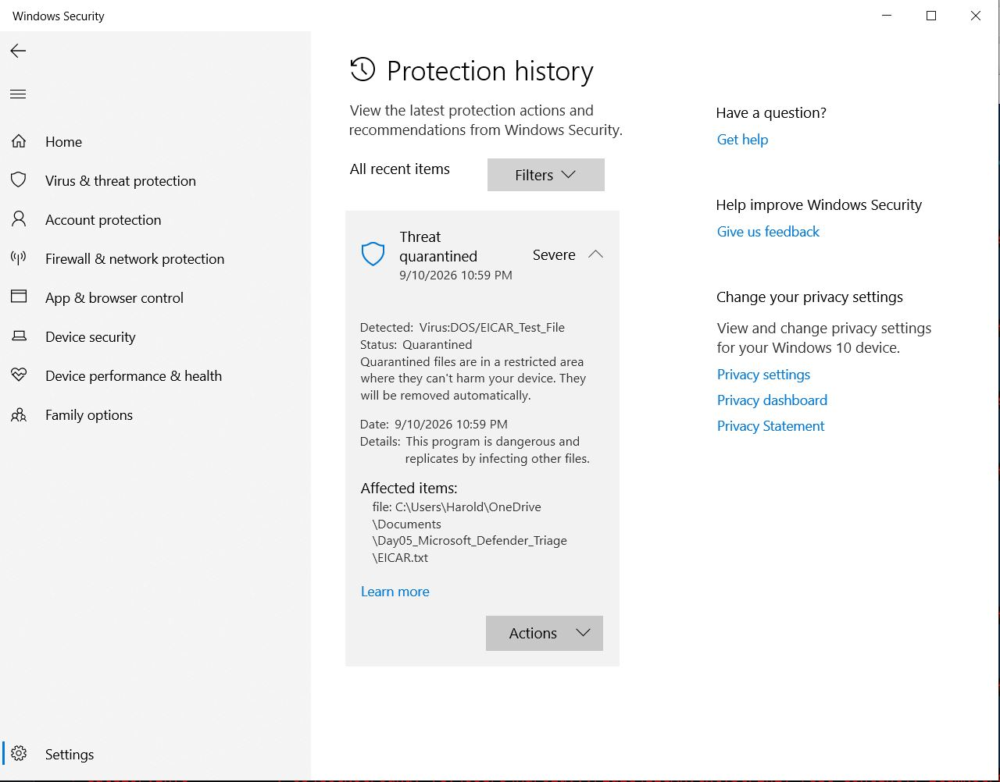
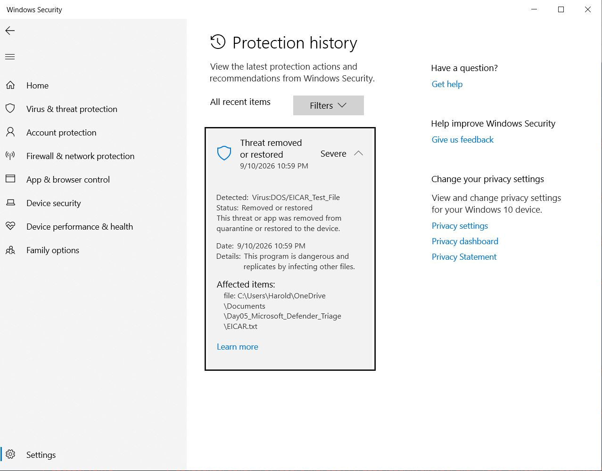
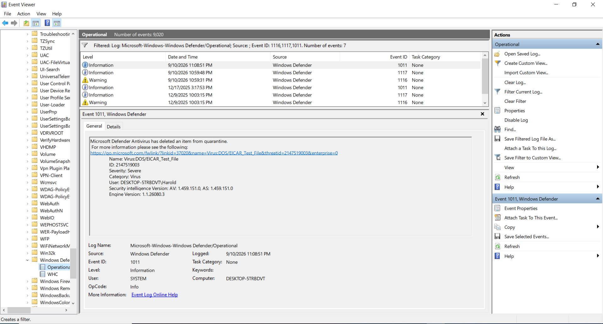

# Day 05 – Microsoft Defender Endpoint Detection and SOC Triage
## Project Overview
This project demonstrates an endpoint-security investigation using Microsoft Defender Antivirus. A controlled EICAR antivirus test file was used to generate a harmless malware alert and validate the detection, quarantine, remediation, and event-log correlation process.
> EICAR is an industry-standard test signature. No real malware was used in this lab.
## Objectives
- Verify Microsoft Defender protection settings
- Generate an authorized endpoint-security alert
- Investigate the threat name, severity, and status
- Validate automatic quarantine
- Remove the test file safely
- Correlate Defender Operational Event IDs
- Document the incident using a SOC triage workflow
## Tools Used
- Microsoft Defender Antivirus
- Windows Security
- Windows PowerShell
- Windows Event Viewer
- EICAR antivirus test file
## Detection Summary
- **Threat:** `Virus:DOS/EICAR_Test_File`
- **Category:** Virus
- **Initial severity:** Severe
- **Initial response:** Quarantined
- **Final response:** Removed
- **User impact:** None
- **Business impact:** None
- **Final classification:** Benign positive
## Incident Timeline
| Time | Event ID | Activity |
|---|---:|---|
| 10:59:31 PM | 1116 | Microsoft Defender detected the EICAR test file |
| 10:59:48 PM | 1117 | Microsoft Defender took remediation action |
| 11:08:51 PM | 1011 | Defender deleted the item from quarantine |
## Defender Event IDs
- **1116 – Detection:** Malware or potentially unwanted software was detected.
- **1117 – Remediation:** Defender took action to protect the endpoint.
- **1011 – Quarantine removal:** Defender deleted an item from quarantine.
## Detection and Quarantine Evidence

## Remediation Evidence

## Event Log Timeline

## SOC Analyst Assessment
The alert was generated intentionally during an authorized endpoint-security lab. Microsoft Defender identified the EICAR signature, assigned a Severe rating, quarantined the file, and prevented it from remaining active on the endpoint.
The file was subsequently removed from quarantine. Windows Defender Operational logs confirmed the detection and response sequence.
No evidence of real malware execution, persistence, lateral movement, credential access, or data exfiltration was observed.
## Final Disposition
- **Classification:** Benign positive
- **Severity after investigation:** Informational
- **Status:** Closed – Authorized security test
- **Containment:** Successful
- **Remediation:** Test file removed
- **Further action:** None required
## Recommended Production Actions
If a similar alert occurred unexpectedly:
1. Validate the threat name, file path, hash, user, and detection time.
2. Determine how the file entered the environment.
3. Review associated processes and command-line activity.
4. Search other endpoints for the same indicator.
5. Review related endpoint and network alerts.
6. Isolate the endpoint if additional malicious behavior is found.
7. Quarantine or remove the file.
8. Perform a follow-up scan and document the incident.
## MITRE ATT&CK Relevance
If a similar file were maliciously delivered and opened, the activity could relate to:
- **T1204.002 – User Execution: Malicious File**
This mapping is contextual only. The EICAR file was harmless and intentionally created for this lab.
## Skills Demonstrated
- Endpoint-security monitoring
- Malware-alert triage
- Detection validation
- Quarantine and remediation
- Windows Defender event-log analysis
- Event-ID correlation
- PowerShell use
- Incident classification
- SOC investigation documentation
## Full Investigation Report
[View the SOC Investigation Report](SOC-Investigation-Report.md)
## Security Note
The EICAR test file was removed and was not uploaded to this repository. The screenshots contain only local lab identifiers and do not expose passwords, credentials, public IP addresses, or security tokens.
